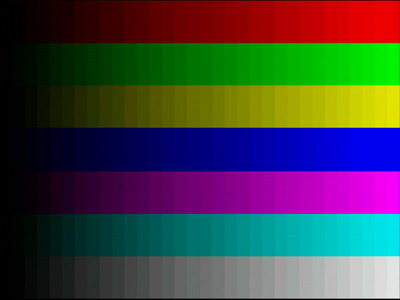
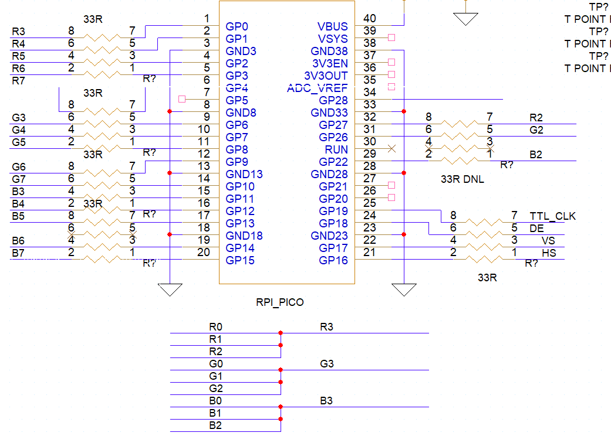

# Raspberry Pi Pico LCD Driver
Code for driving test patterns to an LCD using a parallel (ttl) interface.

Based on code from the [pico-playground](https://github.com/raspberrypi/pico-playground) and [pico-extras](https://github.com/raspberrypi/pico-extras)

These also require the PICO SDK which should be pointed with the PICO_SDK_PATH environment variable.

This can be added to environment or can be added in settings->extensions->CMake Tools Build Environment

The `.vscode/settings.json` file only needs to set the SDK path — board selection is handled via CMake presets (see below):

```json
{
    "cmake.environment": {
        "PICO_SDK_PATH": "../../../pico-sdk"
    }
}
```

## Build Variants

Two build variants are defined in `CMakePresets.json`:

| Preset | Target hardware | Build directory | Bluetooth |
|--------|----------------|----------------|-----------|
| `pico2` | Raspberry Pi Pico 2 (RP2350) | `build-pico2/` | No |
| `pico2_w` | Raspberry Pi Pico 2 W (RP2350 + CYW43) | `build-pico2w/` | Yes |

**VS Code**: select the active variant using the CMake Tools status bar at the bottom of the window ("Pico 2" or "Pico 2 W (Bluetooth)").

**Command line**:
```bash
# Pico 2 — USB serial only
cmake --preset pico2 && cmake --build --preset pico2

# Pico 2 W — USB + Bluetooth Classic SPP
cmake --preset pico2_w && cmake --build --preset pico2_w
```

Flash the resulting `.uf2` from `build-pico2/test_pattern/` or `build-pico2w/test_pattern/` respectively.

## Bluetooth Serial Interface (Pico 2 W)

When running on a Pico 2 W, the firmware advertises a **Bluetooth Classic SPP** (Serial Port Profile) connection named `PicoLCD`. This works exactly like the USB serial connection — all commands, interactive menus, and debug output are available over either interface simultaneously.

### Pairing

1. Power on the Pico 2 W with the `pico2_w` firmware flashed.
2. On your computer, open Bluetooth settings and scan for new devices.
3. Select **PicoLCD** from the list. Pairing completes automatically with no PIN or confirmation prompt (Just Works).

### Connecting on macOS

After pairing, a serial port appears under `/dev/`:

```bash
ls /dev/cu.PicoLCD*
# e.g. /dev/cu.PicoLCD-SerialPort
```

Connect with any terminal emulator:

```bash
screen /dev/cu.PicoLCD-SerialPort 115200
# or
picocom /dev/cu.PicoLCD-SerialPort -b 115200
```

> **Note:** Use `/dev/cu.*` (not `/dev/tty.*`) on macOS. The `cu` device opens without waiting for a carrier signal, which is correct for Bluetooth SPP.

### Connecting on Linux

```bash
# Bind the device (use hcitool scan first if address is unknown)
sudo rfcomm bind 0 XX:XX:XX:XX:XX:XX
picocom /dev/rfcomm0 -b 115200
```

### Connecting on Windows

After pairing in Bluetooth settings, a COM port is assigned (e.g. `COM5`). Connect with PuTTY, TeraTerm, or any serial terminal at 115200 baud.

### Notes

- USB serial and Bluetooth are active simultaneously — disconnect one without affecting the other.
- On the very first boot after flashing, BTstack initialises its flash key store, which takes a moment. Subsequent boots are faster.
- If the device does not appear during scan, ensure the firmware is running (USB serial should be printing the startup banner).

---

## Full Applications

test_pattern.c

- Displays solid fields of red, green, blue, white, black, cyan, yellow, magenta
- Generates a 32 greyshade test patern using the above colors
- Animation (bouncing rectangle)
- LCD border (single pixel white boarder with inner single red pixel on black screen)
- Bitmap (sample text)

Patterns are selectable using a serial terminal connected to the pico USB



pinnout of the pico is:


## Scanout Video

In _scanout_ video, every pixel is driven by the PIO every frame, and a framebuffer is not (necessarily) used (which
is useful when you only have 264K of RAM).

Currently the library only uses 5bits per color (32 greysghades)

For a fuller description of scanout video see [here](https://github.com/raspberrypi/pico-extras/blob/master/src/common/pico_scanvideo/README.adoc)

For displaying a bitmap encode the bitmap into a C byte array using the python [packtiles program](flash_stream/img/packtiles)

Specifically call: `./packtiles -sf bgar5515 text_box.png textbox.h ` to encode a png into a bytearray in a c header "textbox.h".  Also update the macros for height and width

## Custom Bitmap Pattern

The firmware supports a user-supplied full-screen bitmap stored directly in
flash at a fixed offset (1 MB from the start of flash).  No recompile is
needed — you only need to reflash the bitmap data when you want to change it.

### Requirements

- Python 3 with [Pillow](https://pillow.readthedocs.io/) (`pip install Pillow`)
- Either **picotool** or **uf2conv** to flash the image

### Preparing the image

1. Create a PNG at the resolution of your display:
   - DCDU: 480×234 — PSP: 480×272 — AY: 768×256 — VGA: 640×480
2. Run `make_flash_bitmap.py` from the repo root:

```bash
python3 make_flash_bitmap.py my_image.png my_image.bin
```

This converts the PNG to BGRA5515 format, prepends an 8-byte header
(`BIMP` magic + width + height), and writes the result to `my_image.bin`.
The script prints the exact flash commands to use.

### Flashing with picotool

Put the Pico in BOOTSEL mode (hold BOOTSEL while connecting USB), then:

```bash
picotool load my_image.bin -o 0x10100000
picotool reboot
```

### Flashing with uf2conv (drag-and-drop)

```bash
uf2conv -f rp2350 -b 0x10100000 my_image.bin -o my_image.uf2
```

Copy `my_image.uf2` to the `RPI-RP2` drive that appears when the Pico is in
BOOTSEL mode.  The Pico reboots automatically.

> **Note:** flashing the bitmap does **not** overwrite the firmware — the bitmap
> is stored at 1 MB and the firmware occupies the first ~100 KB.  The display
> timing settings (stored at 256 KB) are also unaffected.

### Displaying the bitmap

Press **`i`** in the serial terminal to switch to the custom bitmap pattern.
The firmware reports at startup whether a valid bitmap is present:

```
Custom bitmap in flash: 480x234 pixels
```

If the stored bitmap width is larger than the current display width the
pattern falls back to a black screen.  Reflash a correctly-sized bitmap
after changing the display timing mode.

### Flash memory map

| Region | Offset | Size | Contents |
|--------|--------|------|----------|
| Firmware | 0x000000 | ~100 KB | Compiled binary (copy_to_ram) |
| Settings | 0x040000 | 4 KB | Video timing (saved by `p` command) |
| Bitmap | 0x100000 | up to ~3 MB | Custom bitmap (`BIMP` header + BGRA5515 pixels) |

